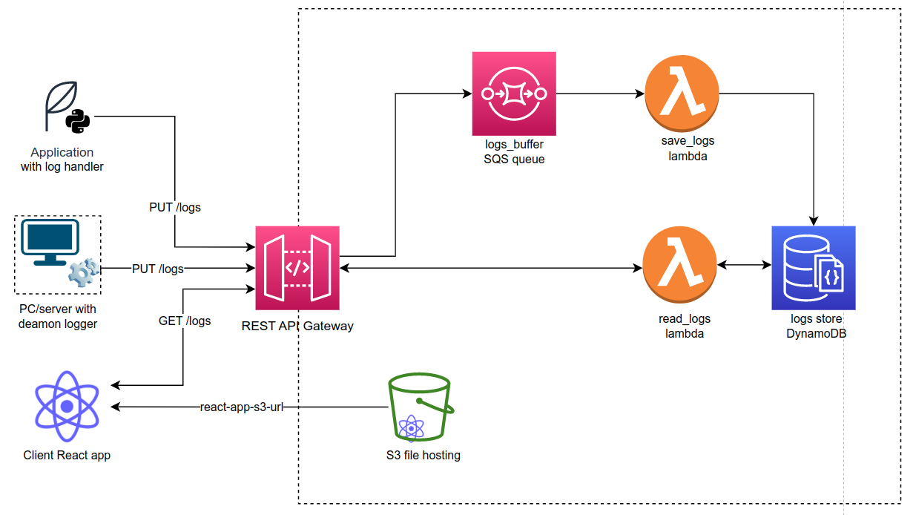

# CloudLog
Logs agregation system built on top of [AWS](https://aws.amazon.com/)  with [Python](https://www.python.org/), [TypeScript](https://www.typescriptlang.org/) and [React](https://react.dev/)

## System Architecture


System contains from for base elements:
1. [Logger deamon](/logger_daemon/) to install on PC
2. [Log handler](/cloud_logger/) for existing python applications
3. [LogSniffer](/log_sniffer/) client React application for logs exploration
4. Backend built on [AWS](https://aws.amazon.com/) with [Terraform](https://www.terraform.io/)

Backend is based on serverless AWS resources.
Thanks to use of Terraform, we can easily create, modify and delete infrastrucutre. The definition You can find in [infra folder](/infra/).
Backend consists of 6 main elements excluding IAM roles:
1. REST API Gateway.
2. S3 bucket used as a hosting for the [LogSniffer](/log_sniffer/) app.
3. DynamoDB database used to store the logs.
4. SQS Queue logs_buffer used as a buffer for incomming requests.
5. Lambda function [save_logs](/lambda/save_logs/) that accepts incomming requests from the SQS queue and save the logs in the database.
6. Lambda function [read_logs](/lambda/read_logs/) used to read the logs

### API
* [Postman documentation](https://documenter.getpostman.com/view/13316422/2s93XyTiMM)
* [Swagger definition](./infra/openapi/cloudlog_api.yaml)

## Deployment
Deploying the application is very easy. All You have to do to get AWS credentials for terraform and place it in `/home/{USER}/.aws/credentials` file, and execute following commands on the [deploy.sh](/deploy.sh) script:
```sh
chmod +x ./deploy.sh #adding permissions
sh ./deploy.sh #execute the script
```

Deployment script will perform the following actions:
1. It will check if all required binaries are installed on Your machine.
2. Run a tests.
3. Plan and deploy the infrastructure.
4. Deploy all services.


## Logs mapping

### Log format
* `os`: string - [Windows,Linux]
* `severity`: number <0-7>
* `message`: string
* `timestamp`: number
* `hostname`: string - workstation name
* `unit`: string - process/application name
* `type`: string - [system, application, logger]
* `raw`: string - raw format of log


### OS logs mapping
| field     | Windows       | Linux                                                    |
| --------- | ------------- | -------------------------------------------------------- |
| os        | "windows"     | "linux"                                                  |
| severity  | Level         | PRIORITY                                                 |
| message   | Message       | MESSAGE                                                  |
| timestamp | TimeCreated   | __REALTIME_TIMESTAMP                                     |
| hostname  | MachineName   | _HOSTNAME                                                |
| unit      | ProviderName  | _EXE                                                     |
| type      | ContainerName | `application` if ("opt" or "snap") in _EXE else `system` |
| raw       | *             | *                                                        |
