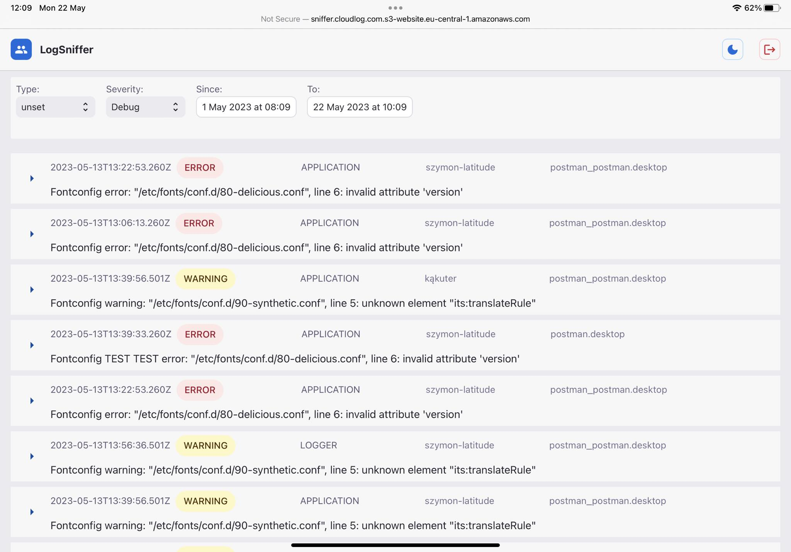
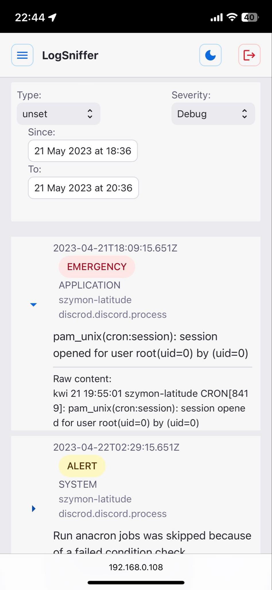

# LogSniffer

Client application for CloudLog system for exploring the gathered logs. Its written in TypeScript and React.
Application is hosted on AWS S3 bucket with hosting configuration. You can reach it with [this link](http://sniffer.cloudlog.com.s3-website.eu-central-1.amazonaws.com/).

## Authorization
At first visit in the application, it will ask You to insert credentials for Your AWS account. If credentials will not be correct, You will see adequate message.

### Demo mode
If You do not have credentials requested on first visit on the site, type `demo` twice into the inputs to enable demo view mode. It will enable You to see the overall look and behaviour of the application.

## View
### Dark mode
App allows You to enable the dark mode. It's accessible by clicking on the moon icon in right upper corner.

### Responsiveness
Supports mobile devices like smartphones and tablets.

Tablet View

Smartphone view

