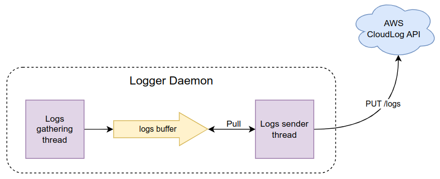

check logs: journalctl -xeu cloudlog.service
ps -aux | grep poetry

sudo systemctl daemon-reload 
sudo systemctl enable cloudlog
sudo systemctl status cloudlog
sudo systemctl start cloudlog
sudo systemctl status cloudlog

# Logger Daemon

CloudLog Logger Daemon is a kind of service that can be installed and run on windows or linux computer. In case of Linux it can be deployed as a backgroud service managed by `systemd` utility.

## Architecture
Daemon consists of three amin components:
* Logs gathering thread
* Logs buffer queue
* Logs sender thread

Logs gathering thread is gathering the logs form the system and sends it to the buffer queue. After that, logs sender thread is poulling the logs from the queue and sends them to the CloudLog system via CloudLog REST API.

## Deployment
In case of Linux system, the deployment is fully automated via Makefile.

Build commands:
* `make build` - creates a package ready to install and run via python `python -m logger_daemon`,
* `make install` - creates a linux `cloudlog` service managed with `systemd` using built package.  
To manage the service there are vew handy commands You need to know:
  * `sudo systemctl daemon-reload` - reloads te systemd services
  * `sudo systemctl [status|start|stop] cloudlog` - check status, starts or stops the cloudlog daemon service.

